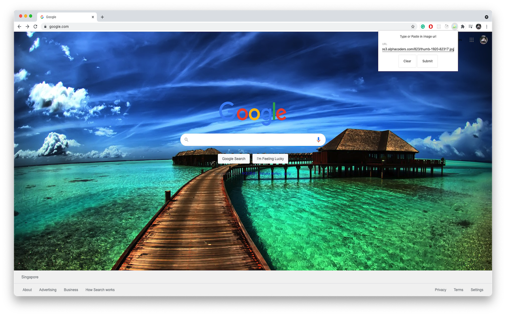

# Overview

Add your custom images to chrome's background! Available only in url matching `https://www.google.com/*`

# Usage

Visit `TODO` on the `https://chrome.google.com/webstore/category/extensions` and search for `TODO` and add it to your extensions

Click on the icon and paste any image url into text field and click `Submit`. (Note if the image doesnt show up, do press the refresh button)

# Implementation Details

# FAQ

Q) How do i clear the background image?
A) Simply press the extension icon and click `clear` (Note if the image doesnt clear, do press the refresh button)

# Acknowledgement

Images - Icons made by www.freepik.com Freepik from www.flaticon.com
